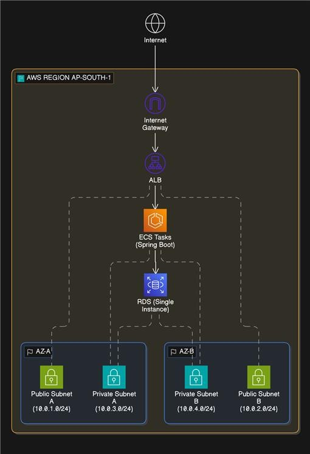

# AWS ECS Production-Style Deployment

## Overview
Deployed a containerized Spring Boot application using AWS ECS, ALB and RDS within a VPC using public and private subnets.

## Key Concepts Demonstrated
- VPC design (public/private subnets)
- ECS service deployment
- Load balancing with ALB
- Secure DB setup (RDS in private subnet)

## Key Design Decisions
- Used private subnets for ECS and RDS to improve security
- Avoided NAT Gateway and used VPC endpoints to reduce cost
- Chose ECS for simplicity over EC2-based deployment

## Challenges & Learnings
→ docs/challenges.md

## ECS Task Definition

A sample task definition is available in:
`deployment/ecs-task-definition.json`

Includes:
- Environment variables
- Secrets via SSM & Secrets Manager
- CloudWatch logging configuration

## Architecture

## Phases
- Phase 1: Manual AWS setup (current)
- Phase 2: Terraform (planned)